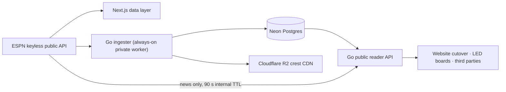

# ScoreArc

ScoreArc is a live, multi-competition fútbol platform built around the 2026
World Cup. The Next.js application is deployed at
[scorearc.futbol](https://scorearc.futbol); the Go backend owns the emerging
public data contract for the website, physical scoreboards, and third-party
consumers.

> **New here?** Read [`VISION.md`](VISION.md) first — the north star: what we're
> building, the signature **arc-bracket** identity, the roadmap (own the data →
> history → AI-powered stats), and fútbol domain knowledge. Then [`AGENTS.md`](AGENTS.md)
> for the working rules and [`BACKEND_HANDOFF.md`](BACKEND_HANDOFF.md) for the backend.



The frontend still uses the ESPN-backed `DataStore`. The reader API is now
implemented; switching the frontend seam to it is the next integration slice.

## Observability

- Vercel Web Analytics automatically records page views, while custom events
  capture competition and section navigation, match-detail and news opens, and
  live-feed outage/recovery transitions. Vercel Speed Insights records web
  vitals for every page.
- Frontend route handlers send a nonblocking `API request failed` event only
  for validated upstream `502` failures. Events contain endpoint, competition,
  and season identifiers; no client headers or cookies are forwarded. A
  process-local, per-dimension one-minute limit prevents an upstream outage
  from exhausting the analytics event allowance. Invalid-route `404`s remain
  visible in Vercel function logs but do not create custom events.
- Fly services emit JSON logs to stdout. Reader access records include request
  id, method, concrete path, route template, status, outcome, response size,
  duration, and client IP. Ingester cycle records include live state, failures,
  duration, and the next sleep interval.

## Internal ingester

`backend/ingester` continuously reconciles the configured competitions from
ESPN into Postgres. It uses rolling scoreboard windows for normal polling,
daily full-season reconciliation, durable retries for unfinished finalization,
bracket-authoritative knockout metadata, and immutable final match history.
Team crests are validated and mirrored to R2.

The process uses a pooled writer DSN for normal work and a dedicated direct
connection for its singleton advisory lease. Run a complete one-shot
reconciliation with:

```bash
cd backend
set -a; . ./.env; set +a
go run ./ingester -once
```

`-once` has no fixed whole-cycle deadline; individual network and database
operations remain bounded. See `backend/.env.example` and
[`docs/backend/SETUP.md`](docs/backend/SETUP.md) for required variables.

## Public reader API

The reader lives in `backend/reader`, uses a SELECT-only Postgres role, and
publishes its complete OpenAPI 3.1 contract at
[`backend/reader/openapi.yaml`](backend/reader/openapi.yaml).

| Route | Source | Cache policy |
|---|---|---|
| `GET /healthz` | coalesced Postgres ping | `no-store`, rate-limit exempt |
| `GET /v1/competitions/{comp}/{season}/matches` | Postgres | 10 s live, otherwise 60 s |
| `GET /v1/competitions/{comp}/{season}/standings` | Postgres | 60 s |
| `GET /v1/competitions/{comp}/{season}/bracket` | Postgres read model | 10 s live, otherwise 60 s |
| `GET /v1/competitions/{comp}/{season}/top-scorers` | Postgres | 60 s |
| `GET /v1/competitions/{comp}/news` | live ESPN proxy, 90 s internal TTL | 60 s |
| `GET /v1/matches/{id}` | Postgres | 30 s |

Responses match the TypeScript models in `src/server/data/types.ts`. Empty
collections are JSON arrays, never `null`. Competition and season identifiers
are checked against the embedded registry before a query runs; every SQL value
uses a pgx parameter.

## Local development

Requirements: Node.js 20+, Go 1.26+, and Docker for the Postgres integration
tests.

```bash
npm install
npm run dev
npm test
npx tsc --noEmit

cd backend
go test -race ./...
go build ./...
go vet ./...
```

The website uses explicit locale-prefixed routes. Open
`http://localhost:3000/en` for English or `http://localhost:3000/es` for
Spanish; an unprefixed page redirects from the saved language preference,
browser language, or English fallback.

Run the reader against a migrated database using the SELECT-only login:

```bash
cd backend/reader
DATABASE_URL='postgres://scorearc_reader_user:…@…/scorearc?sslmode=require' \
PORT=8080 go run .
```

If Docker uses Colima, expose its active socket to Testcontainers:

```bash
export DOCKER_HOST="unix://${HOME}/.colima/default/docker.sock"
export TESTCONTAINERS_DOCKER_SOCKET_OVERRIDE=/var/run/docker.sock
```

See [`backend/reader/README.md`](backend/reader/README.md) for API behavior and
[`docs/backend/SETUP.md`](docs/backend/SETUP.md) for database provisioning.

## Localization

Fixed interface copy lives in complete, typed English and Spanish catalogs —
not in middleware and not as hardcoded component strings. The URL is the locale
source of truth; middleware only redirects unprefixed page requests. See
[`docs/LOCALIZATION.md`](docs/LOCALIZATION.md) for the architecture, translation
workflow, provider-text policy, privacy/security behavior, and verification
checklist.

## Repository map

- `src/app` — Next.js App Router pages and server routes.
- `src/components` — shared UI and colocated pure-logic tests.
- `src/i18n` — locale configuration, typed message catalogs, routing helpers,
  explicit-locale formatters, and hardcoded-copy enforcement.
- `src/server/data` — the `DataStore` seam, competition registry, ESPN mappers,
  fixtures, and frontend data contracts.
- `backend/config` — generated competition configuration embedded in Go.
- `backend/migrations` — current-state, snapshot, operations, and role schema.
- `backend/ingester` — private reconciliation worker, scheduler, and finalizer.
- `backend/shared/espn` — tested Go ESPN clients, domain types, and mappers.
- `backend/reader` — public Go REST API, SQL read models, middleware, OpenAPI,
  unit tests, and Testcontainers integration tests.
- `docs/backend` — system architecture and operator setup.
- `docs/LOCALIZATION.md` — localization architecture and contributor workflow.
- `docs/superpowers/specs` / `plans` — design history and implementation plans.

## Delivery workflow

Work on a feature branch and integrate through a pull request. `main` requires
the GitHub Actions `test` check, up-to-date validation, and PR-based integration,
including for administrators. Force pushes and deletion are blocked. Merging
remains a human decision.

CI validates both PRs and the actual merged `main` commit. Only after its full
`test` job succeeds can that same run release the exact tested SHA, with separate
reader, ingester, and frontend change filters. Vercel Git integration does not
publish `main`; the gated workflow stages and promotes the frontend.

Manual releases use **Actions → CI → Run workflow → main** and rerun the full
suite. Roll back through a revert PR, never a direct old-image deployment.
See the [release runbook](docs/backend/RELEASES.md) for activation, credentials,
retry/recovery and post-merge acceptance; [current state](docs/CURRENT_STATE.md#10-t211-delivery-controls)
distinguishes implemented code from enabled production paths.
