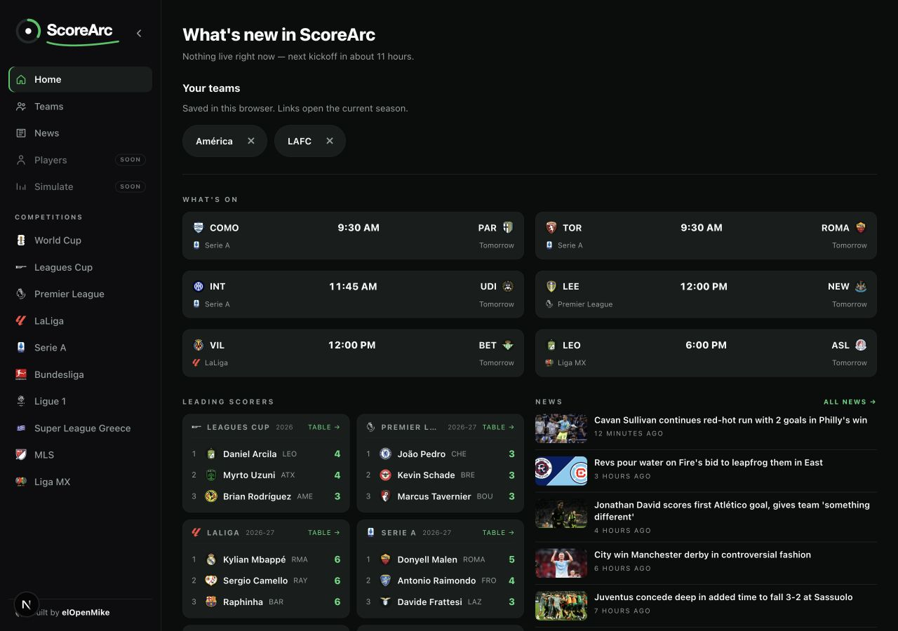
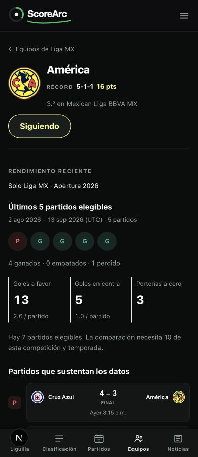
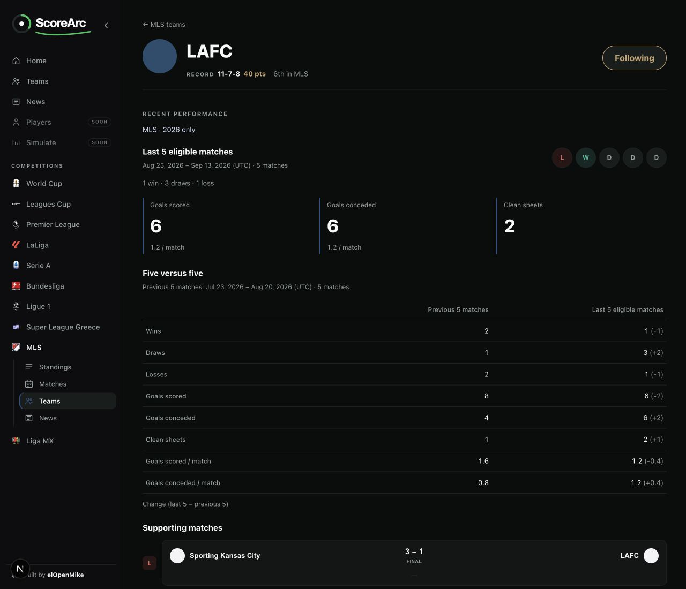
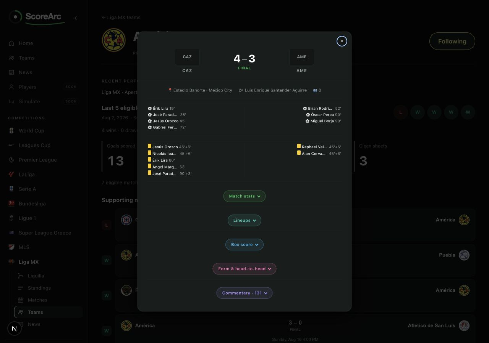

# Team insights — first milestone handoff

Validated locally September 14, 2026 UTC, from `origin/main` baseline `fea71f9`
on `feat/team-insights-local-follows`, then rebased onto current main `504d4bf`
to include its independently merged Next/Vitest upgrades. This change does not merge, deploy, or
activate the reader. Production data still comes through the existing ESPN
`DataStore`.

## Delivered slice

- Existing team pages now extend their form strip with recent performance,
  five-versus-five comparisons, and supporting matches opening the shared detail
  dialog. The existing next match, squad, schedule, links and telemetry remain.
- Team-only Follow/Following controls and home **Your teams** shortcuts. The
  default digest stays useful. Shortcuts disable link prefetch and do not load
  statistics or news for every saved team.
- A bounded T16.1 contract harness: shared recorded/test vectors consumed by
  TypeScript and Go, exact DTO/OpenAPI checks, real handler error/query tests and
  real-Postgres team-schedule scope/order tests. The
  [14-method inventory](backend/TEAM_INSIGHTS_CONTRACT.md) names every gap.

This is partial T16.1 and partial T19.1. The explicit scheduling exception allows
only team-only browser-local follows on the current source before E16 dogfooding.
T19.2 ranking/feed, player/competition follows, accounts, notifications, generated
briefs, reader cutover/shadow traffic and infrastructure work remain out of scope.
The [data-rights gate](decisions/2026-09-01-data-rights-gate.md) remains open; this
does not authorize new collection, redistribution, model training or AI output.

## Statistical definitions

1. Only the selected competition and season are eligible, including the selected
   Liga MX split. Schedule requests specify season; the mapper checks returned
   team, league and season metadata before attaching scope.
2. Require the selected team on exactly one side, a valid kickoff, known
   nonnegative integer scores, `finished`, and a known played final status:
   `STATUS_FULL_TIME`, `STATUS_FINAL_AET`, or `STATUS_FINAL_PEN`.
   Canceled, abandoned, postponed, suspended, awarded, forfeit and unknown
   statuses do not count. Missing scores never become zero.
3. Extra-time goals count; shootout goals do not. A tied match decided on
   penalties counts as a draw, regardless of the provider's winner flag.
4. Deduplicate match IDs before selecting periods. Conflicting counting facts
   exclude that ID; optional detail enrichment is not a conflict. Invalid dates
   are excluded before sorting. Sort newest kickoff first, then ID ascending.
5. Recent means at most five eligible matches. Show the actual sample and date
   range, W/D/L, goals for/against, clean sheets and goals per match. A clean
   sheet means zero known goals conceded. Rates use the actual sample denominator and are displayed to one decimal;
   calculations use the unrounded values.
6. With at least ten eligible matches, compare the last five with the immediately
   preceding five. Show both periods' counts/rates, date ranges and sample sizes;
   changes are recent minus previous. Under ten, omit the comparison. All ten
   counted matches remain inspectable; older evidence uses a keyboard-operable
   disclosure. Date ranges explicitly use UTC; match rows use the browser's
   local time, so a match near midnight may display the preceding local day.

Availability describes successful, scoped retrieval, **not** completeness or
freshness. A verified empty schedule, no eligible played matches, insufficient
history, loading and unavailable results have distinct states. If results cannot
be verified, metrics are withheld; verified schedule rows can still be shown.
There are no recent scorer trends or generated causal explanations.

## Local preference behavior

`scorearc.team-follows` stores `{version: 2, teams: [...]}`. Each record contains
a curated canonical team ID, a preferred competition ID and a validated display
name. No locale, season, provider ID, account or PII is stored. One record per
canonical team; links resolve the current configured season and current locale.
The document is limited to 50 teams and 40,000 characters.

Version 1 uses the same records but may contain competition-scoped duplicates;
migration keeps the final entry per canonical team in memory until the next
explicit edit. Initialization never writes. Corrupt data shows a notice and can
be replaced by an explicit edit; unknown future schemas are protected from all
writes. Blocked/quota-limited storage retains usable session state with a clear
non-persistence notice and retries on the next edit. Clean tabs receive storage
events; dirty session state is retained. Concurrent saved edits are last-write-
wins, with no cross-device synchronization. Preferences are not sent to telemetry
or a preference server. Clearing browser storage removes saved follows.

## Validation and independent review

- `npm test`: 85 files, 1,084 tests passing on Vitest 5.0.0, including performance edge cases,
  mapper scope, local follows/hydration, shared details/telemetry and contracts.
- `npx tsc --noEmit`: clean. `npm run lint`: zero errors; seven existing warnings.
- `npm run build` on Next 16.3.4: passed with the dev server stopped first. Existing framework
  deprecation warnings remain. The dev server was restarted afterward.
- Backend `go build ./...`, `go test -race -p 2 -count=1 ./...`, and `go vet ./...`:
  passed using the isolated `scorearc-t211-validation` Colima profile and its
  documented socket environment. No shared Docker data was pruned or repaired.
- Deliberate score and nullability mutations failed the contract checks and were
  restored before passing checks; details are in the contract document.
- Knights' independent Sol/Terra panel covers correctness, tests, security,
  documentation, architecture and performance, plus the Ponytail complexity pass.
  Findings about mixed invalid-date ordering, parseable invalid calendar dates,
  and incomplete comparison output were fixed with regression tests. Exact final round evidence accompanies
  the PR; no independent approval or full DataStore parity is implied.

Real browser checks used the existing DataStore, in English and Spanish: América
(Liga MX, seven eligible), Arsenal (Premier League, four), and LAFC (MLS, ten-plus).
Phone widths 320/390/560 and desktop were visually inspected, including the
revised comparison. Keyboard follow/remove/disclosure, persisted reload and
locale navigation, real cross-tab removal, and the loaded match-detail dialog
(Escape and focus restoration) worked without observed console errors. New
controls introduce no animations and preserve existing reduced-motion rules.

Storage-disabled browser testing used a temporary local harness mounting the
actual follow/shortcut components after making `localStorage` throw
`SecurityError`; following and removing stayed usable with the session-only
notice. The harness was removed. Automated tests additionally cover write quota,
corrupt/future schemas, migration, season changes and SSR hydration.

## Inspect locally

Run `npm run dev -- --port 3100` if the handed-over server is no longer running.

| URL | What to inspect |
| --- | --- |
| [English home](http://localhost:3100/en) | Follow a team first, then reload: Your teams links to its current-season performance; the default digest remains. |
| [América in Spanish](http://localhost:3100/es/c/liga-mx/2026-apertura/team/mex-america#performance) | Follow state, actual five-match metrics, no manufactured previous period, supporting match details. |
| [Arsenal in English](http://localhost:3100/en/c/premier-league/2026-27/team/eng-arsenal#performance) | A small sample with its actual denominator and per-match rates. |
| [LAFC in English](http://localhost:3100/en/c/mls/2026/team/usa-lafc#performance) | Two five-match windows, neutral changes, and the previous-period evidence disclosure. |

These are observation-time examples, not guaranteed future totals or evidence
that provider coverage is complete. Follows are local to the browser/origin;
your normal browser starts with its own preferences.

## Screenshots

