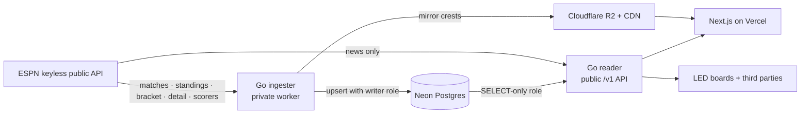
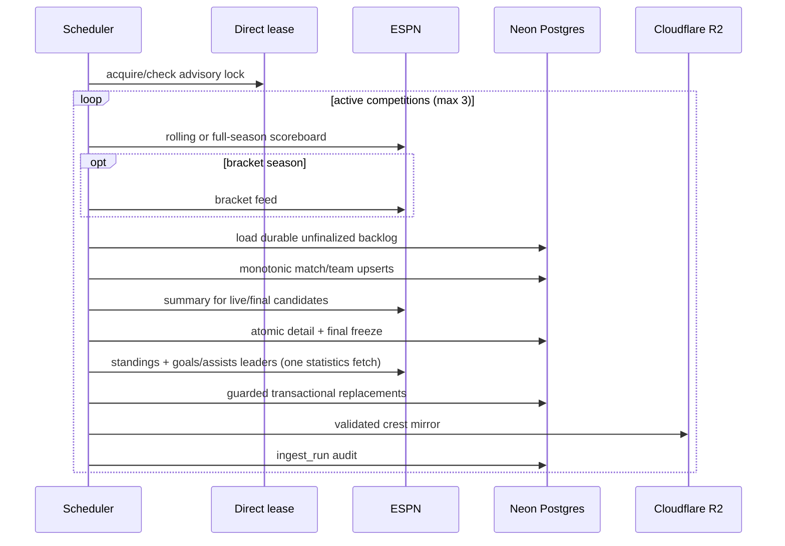
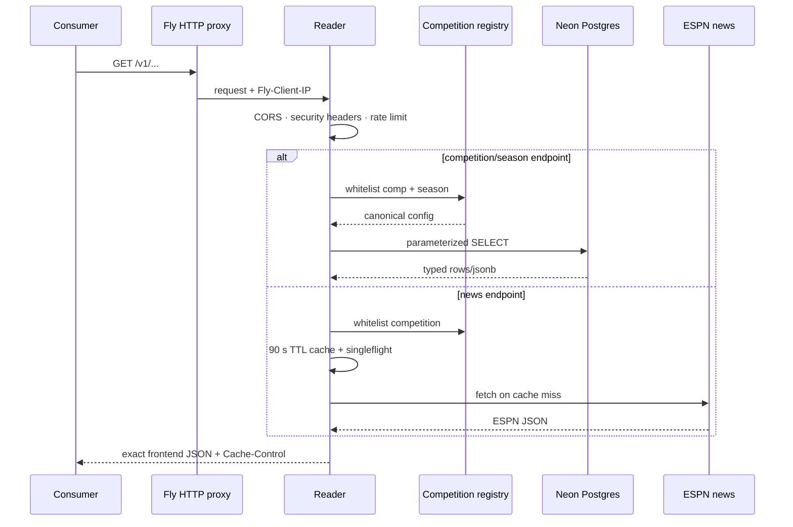

# ScoreArc Backend — Architecture

Self-contained design reference for the backend. The full original spec is
`docs/superpowers/specs/2026-07-22-backend-api-phase1-design.md` (its GCP infra
section is superseded by the Fly+Neon+R2 pivot; everything else here matches).

---

## 1. System diagram



- **Live vs historical is a first-class axis.** Current state is hot/mutable
  (upserted). A finished match is frozen (`finalized_at`) and immutable →
  historical results accrue for free. Time-series snapshots are append-only
  (Phase 2). The ingester behaves accordingly (upsert while live; write-and-freeze
  on finish).

---

## 2. The seam (why this is low-risk)

The frontend reads through **one interface**, `DataStore` (`src/server/data/store.ts`):

```ts
interface DataStore {
  getMatches(rc): Promise<Match[]>
  getStandings(rc): Promise<Group[]>
  getBracket(rc): Promise<BracketRound[]>
  getMatchSummary(rc, eventId, homeId, awayId): Promise<MatchSummaryData>
  getTopScorers(rc): Promise<TopScorer[]>
  getNews(rc): Promise<NewsArticle[]>
}
```

Today it's ESPN read-through + TTL cache. Phase 1 adds a second implementation,
`apiStore`, that calls our reader. **No page or component changes** — only the
seam swaps (slice 1d, behind a `DATA_SOURCE` flag with ESPN fallback). The
reader's JSON must deserialize into the existing types in
`src/server/data/types.ts`.

---

## 3. Database schema (Neon Postgres)

**Every id in this schema is one ScoreArc mints — no provider is the identity
authority.** Curated sets are slugs (`competition.id` = `premier-league`,
`team.id` = `eng-manchester-united` | `nat-mex`), machine-generated sets are
UUIDv7 (`match.id`, `player.id`). Provider ids live **only** in the
`*_external_ref` crosswalk tables, so a second source describes the same entity
instead of duplicating it. `competition_id`/`season_id` are still the **text
config keys** from `competitions.ts` (config stays the source of truth), but
they are now materialised as real `competition`/`season` rows that the other
tables reference. Rich per-match detail is **jsonb** (lossless, serves the
existing frontend types verbatim). **No `news` table** (proxied live).
`team.crest_url` holds **our R2/CDN URL**, and the team seed never overwrites a
stored crest — it only fills an empty one, so re-seeding on every start cannot
revert a mirrored crest to a provider hotlink. Full rationale:
`docs/superpowers/specs/2026-08-12-canonical-identity-design.md`.

> **Bracket note (important — the frontend does NOT derive brackets from the
> matches feed today).** Currently `DataStore.getBracket` fetches a *separate*
> ESPN bracket scoreboard (`bracketUrl(slug, season.bracketDatesRange)`) and runs
> `mapBracket` (`providers/espn-bracket.ts`), which has non-trivial winner +
> shootout logic. In our backend there is **no bracket table** — the reader
> rebuilds `BracketRound[]` from `match` rows — but that only works if the
> **ingester persists knockout matches with `match.round` set to the slug
> vocabulary in each season's `knockoutRounds`** (`round-of-32 … final`) plus
> `winner_id` and shootout. So: port `mapBracket` to Go, **fixture-test it against
> `src/server/data/__fixtures__/espn-bracket*.json`**, and have the reader group
> `match` rows by `round` into `BracketRound[]`. (Leaf ordering lives in
> `competitions.ts`/`radialBracketModel.ts` on the frontend — correctly not in
> the backend.) See §10.

Migrations: `backend/migrations/0001_init.*.sql` (canonical entities, the
crosswalk, Tier-1, ops, roles/grants, durability columns, indexes, and history
guards) and `0002_snapshots.*.sql` (Tier-3). The pre-launch `0003`/`0004`
migrations were folded into `0001` when the schema was re-keyed onto canonical
ids; there is no deployed database to migrate forward from them.

Data backfills must run before finalized-history protection triggers are enabled.
A future migration that intentionally rewrites finalized matches or details must
disable the relevant trigger only for the bounded rewrite and re-enable it in the
same transaction.

### Canonical entities (ids ScoreArc mints)
- **competition**(id PK `text` slug, name, short_name, kind[`league|cup`], country, updated_at)
- **season**(PK (competition_id→competition, id `text` e.g. `2026-27`), label, has_bracket)
- **team**(id PK `text` slug, kind[`club|national`], name, short_name, abbr, country, crest_url, **provisional**, updated_at) — identity is curated in `backend/config/teams.seed.json`; a team the seed does not carry is minted `provisional` (`prov-espn-<id>`) so ingestion never blocks, and a partial index lists those awaiting curation.
- **player**(id PK `uuid` v7, full_name, known_as, birth_date, nationality, position, updated_at) — resolved from the provider's athlete id via `player_external_ref`, never from a display name: two players who share a name must not become one person. Note there is deliberately **no `team_id`** — a player's club is recorded per `appearance`, so a transfer needs no special handling.

### Source crosswalk (the only place provider ids live)
- **competition_external_ref** / **team_external_ref** / **player_external_ref** /
  **match_external_ref**(PK (source, source_id), *canonical id*→entity ON DELETE CASCADE, first_seen_at, last_seen_at) — the PK is `(source, source_id)`, not the canonical id, so **many** provider ids may map to **one** entity, which is exactly what merging duplicates produces. Each has an index on the canonical id for the reverse lookup.

### Tier 1 — current state (hot, upserted by the ingester)
- **match**(id PK `uuid` v7, competition_id, season_id, round, kickoff, **kickoff_date** (generated, UTC date), state[`scheduled|live|finished`], home_team_id→team, away_team_id→team, home_score, away_score, minute, status_detail, status_name, winner_id→team, note, home_placeholder, away_placeholder, bracket_required, **finalized_at**, source, updated_at) — FK to `season(competition_id,id)`; **UNIQUE (competition_id, season_id, home_team_id, away_team_id, kickoff_date)** is the natural key that makes the same fixture from a second source resolve to one row; indexes on `(competition_id,season_id,kickoff)`, `state`, and unfinalized history.
- **match_detail**(match_id PK→match, scorers jsonb, cards jsonb, stats jsonb, win_probability jsonb, shootout jsonb, shootout_detail jsonb, lineups jsonb, videos jsonb, info jsonb, form jsonb, h2h jsonb, commentary jsonb, updated_at)
- **match_commentary**(PK (match_id→match, **seq** = ESPN's `sequence`), period, clock_value, clock_display, play_type, play_type_text, wallclock, text) — minute-by-minute commentary **with the structure `match_detail.commentary` drops** (T7.11). That jsonb column is unchanged and remains the reader's `MatchSummaryData.commentary` contract; it keeps `{minute, text}` only. This table adds guaranteed order (`sequence`), a numeric clock (`play.clock.value`, falling back to `time.value`; the recorded pre-match, kickoff, and match-end entries have an empty `time.displayValue`), the machine play type (`play.type.type`, so consumers need not regex English prose), and mutability (`match_detail` is frozen by `protect_finalized_detail` once a match finalizes). Rows are upserted and then tail-pruned like `match_event`; an **empty payload is a no-op, not a delete**, because commentary coverage varies by competition and has been observed at zero. Missing numeric provider fields remain SQL `NULL`, distinct from a measured zero. A failed write leaves a finished match unfinalized so the next cycle retries before freezing its detail. **Nothing here is parsed** — E6's shot-log parser is downstream and gated on T6.1's coverage probe.
- **standing**(PK (competition_id,season_id,team_id→team), group_id, group_name, rank, played, wins, draws, losses, goals_for, goals_against, goal_difference, points, advanced, source, updated_at) — `group_id`/`group_name` (e.g. "A"/"Group A") are nullable: populated for multi-group competitions (e.g. World Cup group stage), null for single-table leagues.
- **top_scorer**(PK (competition_id, season_id, **category**, rank), player, team_abbr, team_name, team_crest_url, goals, matches, source) — any season leaderboard, not only goals. `category` is `goals` | `assists`, both written from a **single** `/statistics` fetch (T7.8): `assistsLeaders` ships in the same response as `goalsLeaders`, 50 rows each, and was previously discarded. `category` is in the primary key because rank is only unique within a board. The reader's `/top-scorers` filters `category = 'goals'` to keep its existing contract. Team is denormalized (ESPN's stats give abbr/name/crest, no id). The table keeps its name deliberately — renaming it to `season_leader` would rewrite the reader's query, its OpenAPI schema and its fixtures for no behavioural gain.
- **appearance**(PK (match_id→match, player_id→player), team_id→team, starter, shirt_number, position) — who was in the squad, **including substitutes**; the `lineups` jsonb above keeps starters only because that is what the site renders. This is the table that makes "minutes played" computable.
- **match_event**(PK (match_id→match, **seq**), player_id→player NULL, team_id→team, type[`goal|own_goal|yellow|red|sub_on|sub_off`], minute, penalty, shootout, detail) — one row per player-action, so a substitution is two rows rather than one row with two players. `seq` is a deterministic ordinal, **not** a surrogate uuid: a live summary is re-fetched every 20s and a surrogate key would duplicate every goal on every poll. `player_id` is nullable because an event the provider reports without an athlete id still happened — we record it unattributed rather than inventing a player. `penalty` is a flag, not a type, so penalties stay inside `type = 'goal'`.

### Tier 3 — time-series (created now, WRITTEN in Phase 2 via `emitSnapshots()`)
- **standing_snapshot**(id bigserial, competition_id, season_id, team_id→team, captured_at, rank, points, goal_difference, played) — append-only.
- **win_prob_snapshot**(id bigserial, match_id, captured_at, home, draw, away) — append-only.

### Ops
- **ingest_run**(id bigserial, competition_id, kind, started_at, finished_at, ok, error) — observability. Beyond per-operation runs it also records the identity events a human has to act on: `provisional_team` (a club nobody has curated), `team_promotion` (a curation that could not complete), and `player_capture` (a match where the provider sent no athlete ids — without this, total capture failure and a match where nothing happened are the same empty table).

### Roles (least privilege — enforces the read-only public path)
- `scorearc_reader` → **SELECT only** (the public reader connects as this).
- `scorearc_ingester` → SELECT/INSERT/UPDATE plus narrowly scoped DELETE for
  atomic standings/scorer replacement, curation promotion, participation
  replacement, and audit retention (only it writes). Every DELETE grant is
  named table-by-table; `ALTER DEFAULT PRIVILEGES` deliberately does **not**
  include DELETE, so a new table that needs it must say so — a missing grant
  surfaces as a 42501 inside the ingester, which is how curation once shipped
  permanently broken.
- `ALTER DEFAULT PRIVILEGES` mirrors these so future tables inherit them.

---

## 4. Ingester (slice 1b — implemented Go worker)

- Always-on (Fly `min_machines_running = 1`), **no public HTTP**.
- A dedicated direct/unpooled pgx connection holds a PostgreSQL advisory lock.
  Normal writes use `POOLED_DSN`; lease health is checked independently during
  each cycle so losing the singleton session cancels work and terminates.
- Active competitions poll every 20 seconds while any match is live and every
  five minutes otherwise. Slow cycles reconcile the current season, retry
  failed reconciliation after 30 minutes, and refresh successful reconciliation
  daily. Normal scoreboards use a rolling `-30d/+7d` window with foreign-season
  events filtered; full-season backfills reject season mismatches.
- Work is bounded to three competitions concurrently. Two successful empty
  polls are required before a competition becomes dormant; failed polls reset
  that sequence and preserve known live cadence.
- Provider ids are **resolved to canonical ids before anything is written**
  (`backend/shared/store/identity.go`). The ingester calls `Store.Team` and
  `Store.Match`: each looks `(source, source_id)` up in the crosswalk, falling back
  to the curated team seed or the `match` natural key. A team the seed does not carry
  becomes a `provisional` row rather than failing the poll — logged and recorded in
  `ingest_run` — and curating it later repoints the existing rows instead of creating
  a duplicate. A match crosswalk hit is verified against the competition and season
  being ingested, so one provider event id cannot carry facts across competitions.
  `Store.Competition` and `Store.Player` exist for the same crosswalk but have no
  production caller yet: the ingester takes the competition from its own config
  (`comp.ID`), and player identity is written by the follow-on slice. The ESPN mappers
  still speak ESPN ids; nothing downstream of the resolver does.
- Current state is idempotently upserted. State cannot regress except
  live→scheduled for ESPN's explicit postponed or suspended status. Sparse payloads preserve
  known scores, winners, detail arrays, and bracket placeholders.
- Unlike the frontend's legacy `post → finished` mapping, the ingester keeps
  unknown incomplete `post` statuses mutable (`live`) and maps postponed or
  suspended matches to `scheduled`; only provider-confirmed or explicitly
  terminal statuses become immutable history.
- Final match and detail data commit in one transaction. Database triggers make
  finalized rows immutable. Failed finals remain queryable through the
  unfinalized backlog; persisted `bracket_required` classification prevents a
  restart from losing knockout safety.
- Bracket metadata is authoritative for knockout round, placeholders, and
  shootout winner. A bracket outage blocks only candidates still requiring that
  metadata; group-stage matches continue finalizing, while knockout candidates
  require confirmation from the current successful bracket response before
  immutable finalization.
- Standings and season-leader replacements are transactional. Empty leader
  categories preserve their existing rows; empty or suspiciously partial
  standings payloads preserve the prior snapshot rather than deleting valid
  rows and remain retryable failures. ESPN statistics responses carry
  unreliable season metadata, so leaderboard season scoping relies on the
  requested statistics URL rather than rejecting the payload's reported year.
- Crest downloads allow only validated public HTTP(S) sources, enforce
  redirects/content type/size/deadline limits, and upload deterministic R2 keys.
- Every provider/store operation and global audit-pruning pass records an
  `ingest_run`. Old audit rows are pruned in bounded batches.
- `go run ./ingester -once` performs one complete slow reconciliation without a
  fixed whole-cycle deadline; individual operations remain bounded.



---

## 5. Reader (slice 1c — implemented public Go REST API)

- Public, autoscaling, scale-to-zero. Versioned under `/v1`.
- Endpoints mirror the 6 `DataStore` methods:
  - `GET /v1/competitions/{comp}/{season}/matches`
  - `GET /v1/competitions/{comp}/{season}/standings`
  - `GET /v1/competitions/{comp}/{season}/bracket`  (computed read-model)
  - `GET /v1/competitions/{comp}/{season}/top-scorers`
  - `GET /v1/matches/{id}`  (summary/detail)
  - `GET /v1/competitions/{comp}/news`  → **live proxy to ESPN** (short TTL cache), NOT DB-served.
- **Response shapes match the frontend types.** Publish an **OpenAPI** doc as the
  shared contract. The implementation and OpenAPI 3.1 document live in
  `backend/reader/`; contract tests load the document and validate every public
  response model.
- **Cacheable:** `Cache-Control` (short TTL for live, longer for finished/static)
  so consumers—and an optional future API CDN—can cache and shield the DB.
- **Rate-limited** per IP (app-level to start). Open read tier now; API
  keys/quotas deferred until a consumer needs them.
- The limiter tracks at most 10,000 clients with LRU eviction. `/v1` dependency
  work has a ten-second context deadline. Health checks are rate-limit-exempt
  but DB pings are coalesced and cached for two seconds; health and all error
  responses are explicitly `no-store`.

### Reader request flow



The process has explicit read/header/write/idle timeouts and graceful signal
shutdown. Empty public collections are normalized to `[]` at both top-level and
nested response locations.

---

## 6. Security model

- **Public:** only the reader (curated, read-only, versioned). **Private:** the
  DB (Neon, not exposed to the public — the reader is the only thing consumers
  reach) and the ingester (no public HTTP).
- **Injection-proof by construction:** parameterized queries only (**sqlc** or
  pgx placeholders) — no string-built SQL exists; typed/whitelisted inputs
  (`comp`/`season` validated against `competitions.json`; ids are opaque
  parameters); no free-form query surface. The reader DB user is **SELECT-only**,
  so the public path physically cannot write.
- **Secrets** (DB DSNs, R2 keys) live in **Fly secrets** / GitHub Actions
  secrets — never in code.
- **TLS everywhere** (Fly HTTPS; Neon requires `sslmode=require`).
- **App rate limiting now; optional future API CDN caching** as
  defense-in-depth/scale. Cloudflare currently fronts R2 assets, not the Fly
  reader origin.
- **Client IP trust boundary:** the direct Fly HTTP deployment uses a valid
  `Fly-Client-IP` value and otherwise the TCP peer. The reader deliberately
  ignores `X-Forwarded-For`. Adding another proxy in front of Fly requires a
  reviewed trusted-proxy policy before rollout.

---

## 7. Frontend cutover (slice 1d)

- Add `apiStore` implementing `DataStore` by calling the reader `/v1` endpoints
  and deserializing into the existing types.
- `DATA_SOURCE` env flag (`espn` | `api`) selects the implementation; default
  `espn` until parity is verified, then flip to `api`.
- During rollout, `apiStore` **falls back to the ESPN store on error** so a
  backend issue never dark-pages the site.
- Set `SCOREARC_API_BASE` (the reader's public URL) in Vercel env.

---

## 8. Testing strategy

- **Go mappers:** unit tests against the recorded ESPN JSON fixtures (parity with
  the TS mappers) — copy/reference `src/server/data/__fixtures__/`.
- **Repository layer:** reader tests apply the real migrations to ephemeral
  Postgres 16 via **Testcontainers**, seed representative data, exercise every
  SQL read model, and prove the reader role cannot INSERT/UPDATE/DELETE/DDL.
- **Reader handlers/middleware:** fast fakes cover all routes, registry
  validation, sanitized dependency failures, CORS, cache headers, health, client
  IP selection, rate limiting, and server timeout configuration.
- **News:** mapper edge cases plus deterministic TTL, failure, defensive-copy,
  race, and concurrent singleflight coverage.
- **Contract:** tests load and validate `backend/reader/openapi.yaml`, require
  exact object fields, and validate representative JSON for every endpoint
  response. Slice 1d will additionally parse real reader output in `apiStore`.
- **Frontend:** `apiStore` unit test against a mocked reader response.

---

## 9. Deferred to later phases (do NOT build in Phase 1)

- **Phase 2** — time-series *writes* + an analytics store. Options when we get
  there: **BigQuery** (usable cross-cloud via API even off GCP), **R2 + DuckDB /
  MotherDuck** (data-lake on the object storage we already have — natural fit),
  **ClickHouse Cloud**, or just partitioned Neon/Postgres until it outgrows it.
  The `emitSnapshots()` hook + snapshot tables are the seam; whatever we pick
  attaches there without reshaping Phase 1.
- **Phase 3** — historical backfill. **Revised 2026-08-15:** xG no longer needs an
  external source. ESPN's *core* host serves shot geometry directly and T7.12/T7.13
  persist it, so scraping and open data (football-data.co.uk, StatsBomb; FBref/Understat
  are ToS-gray and rate-limited) are **not** on the critical path for xG. They remain
  options for pre-2026 *results*, which our own ingestion cannot reach.
- **Phase 4** — own ML precomputed into the DB (**xG = epic E9**, trained on our own
  persisted `match_play` geometry; odds=Dixon-Coles, season sim=Monte Carlo,
  similarity=clustering→pgvector). E9's spec is
  `docs/superpowers/specs/2026-08-15-expected-goals-design.md`; note its hard
  prerequisite is T7.12/T7.13, because a model cannot be trained on data we did not keep.
- **Phase 5** — Claude language layer (auto match summaries via Haiku + Batch API;
  conversational Q&A via **tool-use over our own endpoints**, not text-to-SQL;
  "matches like this" via embeddings + pgvector). Don't train an LLM.
- **LED board** — a physical scoreboard (Adafruit Matrix Portal S3 + HUB75
  panels) that just polls a compact `/v1/…` endpoint when built.

---

## 10. Pinned contracts and slice boundaries

The prose above is not enough to implement directly — nail these down (in each
slice's plan) so the Go output matches the frontend verbatim. The **source of
truth is the TS**: `src/server/data/types.ts` (shapes), `providers/espn-*.ts`
(mapping), `endpoints.ts` (ESPN URLs), `store.ts` (how each method is assembled),
`__fixtures__/` (recorded ESPN JSON to test against).

**1b — Ingester (implemented)**
- **Mapper → table map:** `espn-matches.ts` → `match`; `espn-summary.ts`
  (scorers/cards/stats/winProb/lineups/videos/info/form/h2h/commentary/shootout) →
  `match_detail` **jsonb** columns; `espn-standings.ts` → `standing`;
  `espn-stats.ts` → `top_scorer`; `espn-bracket.ts` → knockout `match` rows (see
  the bracket note in §3). `espn-news.ts` is **not** ingested (reader proxies it).
- **ESPN URLs to port:** `endpoints.ts` — `scoreboardUrl(slug, datesRange)`,
  `standingsUrl`, `summaryUrl`, `bracketUrl`, `statisticsUrl`, `newsUrl`. Which
  comps/seasons + date ranges to poll come from `backend/config/competitions.json`.
- **jsonb payloads must equal the `types.ts` shapes** so the reader can hand them
  back unchanged — fixture-test the Go mappers against `__fixtures__/`.
- **"Live" detection** for the fast/slow cadence: any polled `match.state == 'live'`.
- **Freeze predicate:** on `state → finished`, write finals, set `finalized_at`,
  and skip re-upsert while `finalized_at IS NOT NULL`.
- **Asset idempotency:** skip the download if the object already exists in R2
  (HEAD) or `team.crest_url` already points at our CDN.
- Governing implementation details and validation evidence live in
  `docs/superpowers/specs/2026-08-10-internal-ingester-service-design.md` and
  `docs/superpowers/plans/2026-08-10-internal-ingester-service.md`.

**1c — Reader (implemented)**
- **Endpoint → type map:** each `/v1/…` response must deserialize into exactly
  `Match[]` / `Group[]` / `BracketRound[]` / `MatchSummaryData` / `TopScorer[]` /
  `NewsArticle[]` from `types.ts`. Write a field-by-field map in the plan.
- **`/news` drops season:** `newsUrl(slug)` is comp-only; the endpoint is
  `/v1/competitions/{comp}/news` and `apiStore.getNews` builds it from
  `rc.competition`, ignoring season.
- **Query layer:** pick **sqlc** (recommended — compile-checked, parameterized) or
  `pgx` placeholders; either way, no string-built SQL.
- Add a `/healthz` route (used by the deploy check in SETUP §7).
- The machine-readable contract is `backend/reader/openapi.yaml`; behavior and
  local-operation notes are in `backend/reader/README.md`.

**1d — Cutover**
- `apiStore` lives at `src/server/data/apiStore.ts`, implementing `DataStore`.
- Selection happens where the concrete store is chosen in `src/server/data/store.ts`
  (find where the ESPN store is instantiated); switch on `process.env.DATA_SOURCE`
  (`espn` default | `api`), reading the reader base from `SCOREARC_API_BASE`.
- `apiStore` wraps each call in try/catch and **falls back to the ESPN store on
  error** during rollout.
