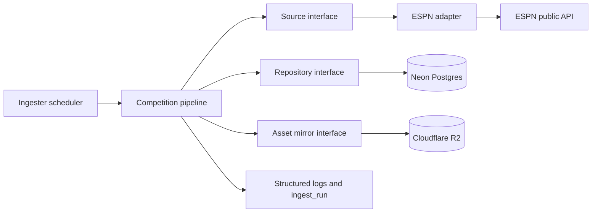

# Internal Ingester Service Design

## Goal

Build ScoreArc's always-on internal ingestion worker as a Go service. It polls
ESPN, maps provider payloads into ScoreArc's canonical football model, persists
matches and competition data in Postgres, freezes complete match history, and
mirrors team crests to Cloudflare R2. The service has no public HTTP surface.

This branch starts from `origin/main`. It includes the prerequisite backend
foundation currently carried by `feature/agents/ingester-service`, followed by
the corrected ingester implementation.

## Scope

The service ingests:

- scoreboards and match state;
- match summaries and detail;
- standings;
- top scorers;
- knockout brackets; and
- team crest assets.

Snapshots and the public database reader remain later phases. ESPN is the only
provider implemented now.

## Architecture



The implementation has five boundaries:

1. `shared/model` owns canonical persisted football types. Provider and storage
   packages depend on this package; canonical types do not belong to ESPN.
2. `shared/source` defines the provider seam and supplies the ESPN adapter.
3. `shared/store` implements parameterized pgx operations behind the repository
   interface used by the ingester.
4. `shared/assets` implements a best-effort R2 crest mirror behind a narrow
   interface.
5. `ingester` owns scheduling, orchestration, state transitions, and logging.

The scheduler does not start a new cycle until the previous cycle completes.
Competition-season pipelines use bounded concurrency so one slow endpoint does
not serialize every competition or create an unbounded request burst. A
Postgres advisory lease enforces the same singleton guarantee across processes,
and cycle deadlines bound dependency stalls.

## Data Flow

```mermaid
sequenceDiagram
  participant Loop as Scheduler
  participant Src as Source
  participant DB as Repository
  participant R2 as Asset mirror

  Loop->>Src: Fetch scoreboard
  Src-->>Loop: Canonical matches
  Loop->>DB: Load existing match states
  loop Each match
    Loop->>DB: Upsert teams and mutable match state
    alt Detail required
      Loop->>Src: Fetch summary
      Src-->>Loop: Canonical detail
      alt Match finished
        Loop->>DB: Atomically store final detail and finalize match
      else Scheduled or live
        Loop->>DB: Upsert mutable detail
      end
    end
    Loop->>R2: Mirror crest when needed
  end
  opt Slow tick or newly finished match
    Loop->>Src: Fetch standings and scorers
    Loop->>DB: Replace each complete dataset transactionally
  end
  opt Configured bracket
    Loop->>Src: Fetch bracket
    Loop->>DB: Process matches through the same match pipeline
  end
```

The scoreboard and bracket feeds share one match-processing path. A finished
match is not frozen by a plain row upsert. Finalization is one transaction that
writes the final match detail and sets `finalized_at`. If fetching or storing
the final summary fails, the match remains eligible for retry. This prevents an
incomplete immutable record.

## Polling and Skip Rules

- Use a 20-second interval while any current match is live.
- Use a five-minute interval otherwise.
- Reconcile the configured current season on process start and every 24 hours;
  use a rolling 30-day lookback and seven-day lookahead between reconciliations.
  Retry failed reconciliations after 30 minutes. Historical configured seasons
  are a later backfill slice.
- Recheck dormant competition-seasons only on slow ticks.
- Fetch live summaries every cycle.
- Fetch a scheduled summary when first seen and on slow ticks thereafter, except
  during the bulk season backfill; a following slow tick enriches it.
- Fetch a finished summary until atomic finalization succeeds.
- Never update a finalized match or its final detail.
- Refresh standings and scorers after a newly finalized match or on slow ticks.
- Reject empty provider datasets for destructive replacement operations so a
  malformed response cannot erase previously valid standings or scorers.
- Mirror each crest once and skip URLs already using the configured CDN base.

Failure to poll a competition preserves its previous active/dormant state. One
successful but empty poll preserves active state while clearing live cadence; a
second consecutive empty poll marks the competition dormant.

## Database Integrity

All SQL is parameterized. Team and mutable match writes are idempotent.
Standings and scorers use delete-and-insert transactions. A new migration grants
the ingester role the `DELETE` privileges those replacements and bounded
`ingest_run` retention require.

Finalization locks the match row in a transaction, rechecks `finalized_at`,
stores final detail, writes final score/state fields, and sets
`finalized_at`. Concurrent retries are safe and idempotent.

Ingest-run rows report the actual outcome of each operation. Partial write
failures cannot be logged as successful. Logging failures are surfaced through
structured warnings without hiding the primary ingest result.

## External Failure Handling

The ESPN client uses request timeouts, bounded response reads, and
context-aware retries for transient network errors, HTTP 429, and HTTP 5xx.
Permanent HTTP errors and invalid payloads fail the operation explicitly.

R2 mirroring performs PUT only after a confirmed not-found response. Permission,
service, and network failures are returned rather than treated as cache misses.
Downloaded assets must have a successful response, an image content type, and a
size within the configured maximum. Source and redirect URLs must use HTTPS on
the ESPN CDN allowlist, and S3 operations have deadlines. Asset failures are
logged but do not fail football-data persistence.

Cancellation interrupts HTTP calls, retry backoff, cycle work, and scheduler
sleep. The service exits cleanly on SIGINT or SIGTERM.

## Testing

Tests are layered:

- mapper parity tests continue using recorded ESPN fixtures;
- source adapter tests use an injectable HTTP server/client;
- store query and transaction behavior is covered without cloud dependencies;
- optional Postgres integration tests run when `DIRECT_DSN` is available and
  skip clearly otherwise;
- R2 tests use fake S3 and HTTP clients to cover hit, miss, authorization
  failure, invalid content type, oversize payload, and PUT failure;
- ingester tests use fake source, repository, and mirror dependencies plus pure
  interval policies to
  cover cadence, dormant recovery, retryable finalization, shared
  scoreboard/bracket processing, partial failures, cancellation, and refresh
  triggers; and
- a `-once` smoke run executes against live Neon/R2 when credentials exist.

The complete repository must pass Go tests, Vitest, TypeScript type checking,
lint, and the production build before the pull request is opened.

## Documentation and Delivery

Update:

- root `README.md` with backend purpose, local commands, and links;
- `BACKEND_HANDOFF.md` with current implementation status;
- `docs/backend/ARCHITECTURE.md` with component and data-flow Mermaid diagrams;
- `docs/backend/SETUP.md` with environment, migration, test, and one-cycle run
  instructions;
- `backend/.env.example` with all non-secret keys; and
- the implementation plan so completed behavior and commands match the code.

No secret values are committed. The completed branch is committed, pushed, and
opened as a pull request against `main`; merging remains the user's decision.
